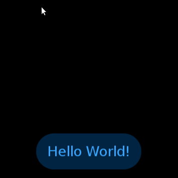

# Basic Button

## Sample Application
<div style="text-align:center;width:100%;"></div>

1. Download files to your NUI project.
    - [BasicButtonStyle.cs](BasicButtonStyle.cs)
    - [SampleApplication.cs](SampleApplication.cs)
2. Write code to run `BasicButtonSampleApplication`.

    ```C#
    using System;

    namespace Tizen.NUI.Samples
    {
        public class Application
        {
            [STAThread]
            static void Main(string[] args)
            {
                new BasicButtonSampleApplication().Run(args);
            }
        }
    }
    ```
3. Build and Run

## Descriptions

### BasicButtonStyle
The `BasicButtonStyle` class provides predefined button style with a simple text.

You need to download the Style file ([BasicButtonStyle.cs](BasicButtonStyle.cs)) to your project.

To apply this Style,
```C#
var button = new Button(new BasicButtonStyle());
```