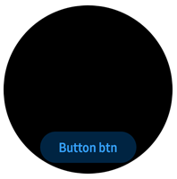

# Bottom Button

## How to apply

1. Download the Style file (BottomButtonStyle.cs) to your project.
2. Apply to a Button component.
```C#
var button = new Button(BottomButtonStyle.GetStyle());
```

## Sample Application
<div style="text-align:center;width:100%;"></div>

```C#
using Tizen.NUI.Components;

namespace Tizen.NUI.Samples
{
    public class NUISampleApplication : NUIApplication
    {
        public NUISampleApplication() : base()
        {
        }

        protected override void OnCreate()
        {
            base.OnCreate();
            Window window = NUIApplication.GetDefaultWindow();
            window.BackgroundColor = Color.Black;

            // Create a button with the style
            var button = new Button(BottomButtonStyle.GetStyle());
            window.Add(button);

            // Positioning it to the bottom
            button.ParentOrigin = ParentOrigin.BottomCenter;
            button.PivotPoint = PivotPoint.BottomCenter;
            button.PositionUsesPivotPoint = true;
            button.Position = new Position(0, -20);
        }
    }

```
