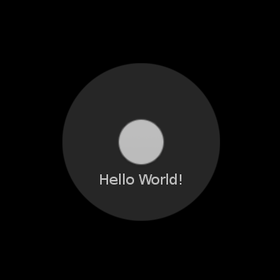

# Bottom Button

## Sample Application
<div style="text-align:center;width:100%;"></div>

1. Download files to your NUI project.
    - [RoundButtonStyle.cs](RoundButtonStyle.cs)
    - [SampleApplication.cs](SampleApplication.cs)
2. Write code to run `PressAnimationSampleApplication`.

    ```C#
    using System;

    namespace Tizen.NUI.Samples
    {
        public class Application
        {
            [STAThread]
            static void Main(string[] args)
            {
                new PressAnimationSampleApplication().Run(args);
            }
        }
    }
    ```
3. Build and Run

## Descriptions

### RoundButtonStyle
It includes `RoundButtonStyle` class which provides predefined button style with an icon and a text within a round shape.

You need to download the Style file ([RoundButtonStyle.cs](RoundButtonStyle.cs)) to your project.

To apply this Style,
```C#
var button = new Button(new RoundButtonStyle());
```

### Button.PressAnimationUIAdaptor
The `Button.PressAnimationUIAdapter` class enables a Button to play predefined animation when pressed.

The class is included in the framework.

To apply this,
```C#
var button = new Button(new Button.PressAnimationUIAdapter());
```
